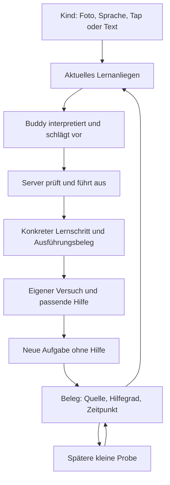

# LearnBuddy — Produkt-, Lern- und Systemaudit

**Stand:** 30. September 2026. **Geprüfter Stand:** `main`, `d3b114a9ec51f05edf35f6a36eac4e27d6ea1698`. **Rahmen:** zunächst einige Wochen mit der Tochter intern testen, wie in [OWNER-INPUT](../docs/OWNER-INPUT.md) festgehalten. Dieser Bericht bewertet diesen nächsten Reifeschritt und trennt ihn vom späteren öffentlichen Release.

## Mein Urteil

Für die konkrete Weiterentwicklung gibt es zusätzlich einen [Produktplan mit Beispielabläufen, Lernwerkzeugen, Issue-Bezügen und drei Lieferungen](LEARNBUDDY-PRODUKTPLAN-2026-09-30.md).

LearnBuddy hat eine klare und wertvolle Produktidee: **Ein Kind bringt seinen echten Schulalltag mit; Buddy übernimmt Kontext und Organisation; das Kind wird beim Verstehen und Üben selbstständiger.** Die ruhige Oberfläche und das neue technische Fundament passen dazu. Ich würde die App weiterentwickeln, nicht erneut komplett neu bauen.

Der zentrale Mangel ist, dass der persönliche Assistent weiter entwickelt ist als der Lernpartner. Das System kann Material lesen, Ziele anlegen, Übungen vorbereiten und Antworten bewerten. Es bildet aber noch nicht zuverlässig den Übergang ab: **Wo hängt dieses Kind? Welche Hilfe passt? Was gelingt danach ohne Hilfe? Was bleibt einige Tage später übrig?** Eine freundlich abgeschlossene Sitzung ist heute zu leicht ein scheinbarer Kompetenznachweis.

Daneben gibt es bestätigte Brüche im Gesprächszustand: alte Materialien werden gefunden, sind anschließend im Gespräch aber nicht gezielt adressierbar; Wiederholungsangaben fehlen im strukturierten Kontext; Bestätigungen sind nicht an ihre Handlung gebunden. Ein besonders ernster Fehler lässt sensible und provider-blockierte Nachrichten über Zusammenfassungen wieder in Modellaufrufe beziehungsweise dauerhaftes Kontextwissen gelangen.

**Die ehrliche Zuspitzung:** Ihr habt viel Navigation entfernt. An einigen Stellen muss das Kind dafür jetzt den unsichtbaren Zustand des Assistenten im Kopf halten. Das ist keine gelöste Einfachheit. Die Lösung sind verlässliche interne Zustände und wenige sichtbare Orientierungspunkte. Ein besserer Prompt allein wird diese Lücken nicht schließen.

## Was untersucht wurde und wie belastbar das ist

Ich habe Produktbeschreibung, Architektur, Datenschutz, Lernlogik, Mobile-UI, Verträge, Migrationen, Jobs, Testsystem und relevante aktuelle sowie alte GitHub-Issues gegeneinander gelesen. Drei ergänzende Teilrecherchen untersuchten traditionelle Lernapps/Lernwissenschaft, AI-Tutoren/OpenClaw und Kontext-/Tool-Architektur. Das Gesamturteil und die Priorisierung sind meine Synthese.

Der neueste geprüfte Stand liegt auf `main`: lokaler HEAD und GitHub-HEAD stimmen überein. Die neun Remote-Branch-Köpfe wurden verglichen; die anderen sichtbaren Entwicklungszweige waren älter. Während der ersten Orientierung wurde der Arbeitsstand noch aktualisiert; alle folgenden Befunde beziehen sich auf den eingefrorenen Commit oben.

| Prüfung                                                       | Ergebnis                                                                                                                   | Aussagegrenze                                                                                                                                    |
| ------------------------------------------------------------- | -------------------------------------------------------------------------------------------------------------------------- | ------------------------------------------------------------------------------------------------------------------------------------------------ |
| Typecheck und Lint                                            | Bestanden                                                                                                                  | Keine Aussage über pädagogische Qualität.                                                                                                        |
| Tests mit verpflichtender lokaler Postgres-Datenbank          | **1.491 bestanden, 1 übersprungen**; API 744, Mobile 685, Mathematik 58, Verträge 4                                        | Der übersprungene Test betrifft native pgvector-Suche; die lokale Datenbank hatte die Erweiterung nicht.                                         |
| Echter kompilierter Web-Build gegen API, Schema und Scheduler | **9/11 Browserfälle bestanden**; beide Fehler am Start der Mikrofonaufnahme                                                | Auth, Storage und Modellantworten sind vorhandene Test-Stand-ins. Das beweist Abläufe, keine Live-Fotoerkennung oder Chatqualität.               |
| Mobile Layout und automatische Accessibility-Prüfung          | 142 Fit-Messungen ohne unzulässigen Overflow; 68 Accessibility-Aufzeichnungen ohne gemeldete Verstöße                      | Vor allem 360/390 px. Erlaubte Scrollflächen existieren. Kein Nachweis vollständiger Screenreader-/nativer Bedienbarkeit oder Tablet-Qualität.   |
| Live-Tutor-Eval mit echtem Vertex-Modell                      | **9/9 Szenarien bestanden**, 12 Modellaufrufe, `gemini-3.6-flash`                                                          | Kleine Stichprobe; bestandene Guardrails beweisen weder Fehlerdiagnose noch verzögerten Lernerfolg.                                              |
| Gezielte Reproduktionen                                       | Materialkappung und „Sitzt“ mit echten Funktionen; Kontext/Undo/Bestätigung/Summary mit echter API und Wegwerf-Datenbanken | Synthetische Lernende und geskriptete Modellentscheidungen; bewusst fehlerhafte Entscheidungen prüfen Servergrenzen, nicht ihre Live-Häufigkeit. |

Es wurde kein echtes Kind in dieser Sitzung beobachtet und kein physisches Telefon getestet. Native Sprache, Kamera, Push, Biometrie, iOS und eine länger laufende echte Lernbeziehung bleiben offen. Konkurrenzprodukte wurden anhand offizieller Quellen recherchiert, nicht mit Kinderkonten vollständig durchgespielt. Kein App-Code wurde geändert und kein Issue oder anderer externer Inhalt geschrieben.

[Messungen, Repro-Skripte und Screenshots](learnbuddy-audit-2026-09-30/) liegen neben diesem Bericht. Die bisherigen Audits wurden als Hinweise genutzt; historische Fehler werden hier nicht automatisch als weiterhin offen behandelt.

## Was schon gut ist — und erhalten bleiben sollte

- **Der Anlass ist echter Schulstoff.** Ein eigenes Blatt und eine bevorstehende Arbeit sind verständlicher als ein generischer Kurskatalog. Das ist eine gute Brücke vom Alltag zur Lernhandlung.
- **Die Haltung ist respektvoll.** Kein Streak-Zwang, kein Rückstands-Dashboard, ruhige Farben, freundliche Sprache und eine erreichbare Pause. Der Orb schafft Wiedererkennung; die App wirkt weder klinisch noch wie ein Spiel für Kleinkinder. [Aktueller Einstieg](learnbuddy-audit-2026-09-30/screens/04-buddy-first-visit-360.png).
- **Die spezialisierte Übungsfläche ist richtig.** Aufgabe, mathematische Darstellung und Eingabe bekommen ihren Platz. Lernen muss nicht vollständig in Chatblasen stattfinden. [Aktuelle Übung](learnbuddy-audit-2026-09-30/screens/10-practice-q1-360.png).
- **Wichtige Regeln liegen im Code.** Tenant-bezogene Aliase, Kontextversionen, atomare Aktionsübernahme, Turn-Claims und Job-Leases sind echte Schutzmechanismen. Ein Modell darf nicht frei eine fremde Nutzer-ID wählen. [apply.ts:96](../apps/api/src/modules/buddy/apply.ts), [turn.ts](../apps/api/src/modules/buddy/turn.ts).
- **Unterstützte Leistung wird bereits teilweise getrennt.** `first_try_correct` setzt einen Erfolg ohne vorherigen Versuch oder Tipp voraus. FSRS unterscheidet ersten Erfolg, Hilfe und gezeigte Lösung und wird einmal pro Item/Sitzung aktualisiert. Das ist ein sinnvoller Ausgangspunkt; die spätere Interpretation ist zu groß. [service.ts:1090][practice-firsttry], [fsrs.ts:31][fsrs].
- **Die Testinfrastruktur ist ungewöhnlich brauchbar.** Integrationstests verwenden reale Migrationen und Wegwerf-Datenbanken; CI verlangt die Datenbank. Offline-Antworten und Wiederaufnahme werden geprüft. Diese Infrastruktur hat die neuen Reproduktionen erst möglich gemacht.

## Recherche: Welche Muster helfen LearnBuddy wirklich?

Upload → automatisch erzeugte Fragen ist bereits verbreitet. Ein nachhaltiger Vorteil muss in der Qualität des nächsten Lernschritts und der verlässlichen Beziehung zum konkreten Schulalltag liegen. Das ist meine strategische Einschätzung aus dem Vergleich.

| Produkt                  | Was daran relevant ist                                                                                 | Was ich für Buddy übernehmen würde                                                                                                                                                                                                                                                                                        |
| ------------------------ | ------------------------------------------------------------------------------------------------------ | ------------------------------------------------------------------------------------------------------------------------------------------------------------------------------------------------------------------------------------------------------------------------------------------------------------------------- |
| ANTON                    | Kuratierte schulische Übungen, verschiedene Antwortformen, inzwischen auch Scannen eigener Lernlisten. | Fachlich verlässliche Aufgaben und mehrere Arten, etwas zu zeigen. [Offizielle Seite](https://anton.app/de/).                                                                                                                                                                                                             |
| sofatutor                | Erklärungsvideos, anschließende Übungen und Arbeitsblätter.                                            | Erklären und selbst Anwenden als zusammenhängenden Ablauf; Papier bleibt Teil der Erfahrung. [Produktbeschreibung](https://www.sofatutor.com/online-lernen).                                                                                                                                                              |
| Quizlet                  | Eigene Materialien, AI-Erzeugung und adaptives Lernen von Auswahl zu schriftlichen Antworten.          | Dieselbe Wissenseinheit zunehmend selbstständig abrufen. Generierung allein differenziert Buddy wenig. [AI-Werkzeuge](https://quizlet.com/features/ai-study-tools), [Learn](https://quizlet.com/gb/features/learn).                                                                                                       |
| Duolingo                 | Vorbereitete kleine Einheiten und Wiederholung innerhalb eines begrenzten Lernpfads.                   | Gute Voreinstellung und ein überschaubares Ende. Sein fester Sprachkurs ist keine direkte Vorlage für beliebige Schulblätter. [Lehrmethode](https://blog.duolingo.com/duolingo-teaching-method/).                                                                                                                         |
| ChatGPT Study mode       | Gestufte Anleitung, Rückfragen, Uploads und Gedächtnis; direkte Antworten bleiben möglich.             | Natürlich anfangen können. Buddy muss Lernzustand und Aufgabenbezug auch dann halten, wenn das Kind nur „hä?“ schreibt. [Offizielle Anleitung](https://help.openai.com/en/articles/11780217-using-study-mode-in-chatgpt).                                                                                                 |
| Khanmigo                 | Tutor auf curricularen Inhalten mit vorhandener Aufgaben- und Lernhistorie.                            | Aktuelle Versuche und konkrete Voraussetzungen nutzen. Buddy muss diese Struktur aus heterogenen Materialien erst herstellen. [Offizielle Übersicht](https://www.khanacademy.org/khan-labs).                                                                                                                              |
| Synthesis Tutor          | Interaktive, visuelle Mathematik für jüngere Kinder in einem engen Fachbereich.                        | Eine passende Handlung oder Darstellung kann mehr erklären als weiterer Text. Die DARPA-Geschichte des Herstellers beweist nicht die Wirksamkeit des heutigen Kinderprodukts. [Produkt](https://www.synthesis.com/tutor), [Herstellerargumentation](https://www.synthesis.com/blog/does-the-synthesis-tutor-get-results). |
| StudyFetch / CK-12 Flexi | Materialbezogene Tutor-Suite beziehungsweise Foto-Fragen mit unterscheidbaren Quellen.                 | Gemeinsame Materialgrundlage und klare Herkunft: „auf deinem Blatt“ gegenüber „mein ergänzendes Beispiel“. [StudyFetch](https://www.studyfetch.com/features/chat), [Flexi-Anleitung](https://help.ck12.org/hc/en-us/articles/36419540412187-Using-Flexi-in-Your-Classroom-A-Guide-for-Teachers).                          |

Das sind veröffentlichte Produktmechanismen, keine unabhängigen Wirksamkeitsnachweise.

**Die wichtigste Forschungswarnung:** In einer randomisierten Mathematikstudie mit knapp 1.000 Jugendlichen verbesserte generischer GPT-Zugang die unterstützte Übungsleistung; ohne Zugang lag diese Gruppe später 17 % unter der Kontrolle. Ein geschützter Tutor vermied den Schaden weitgehend, zeigte aber keinen entsprechend großen selbstständigen Lerngewinn. Das ist ein konkretes Setting, kein Urteil über alle AI-Tutoren. Es begründet, warum Buddy ohne Hilfe messen muss. [Bastani et al., PNAS 2025](https://www.pnas.org/doi/10.1073/pnas.2422633122).

Für die Gestaltung sind außerdem aktiver Abruf mit erreichbaren Hinweisen, zeitlich verteiltes Wiederkehren, nach erster Orientierung gemischte Strategien und schrittweise entfernte Hilfe relevant. Die Originalarbeiten betreffen unterschiedliche Altersgruppen und Fächer; daraus folgt kein universeller Ablauf für jedes Kind. [Abruf bei Kindern](https://www.frontiersin.org/journals/psychology/articles/10.3389/fpsyg.2016.00350/full), [verteiltes Lernen](https://sites.lifesci.ucla.edu/psych-babytalk/wp-content/uploads/sites/271/2021/03/Vlach_Sandhofer-CD-2012.pdf), [gemischtes Mathematiküben](https://files.eric.ed.gov/fulltext/ED595322.pdf), [Hilfen ausblenden](https://pmc.ncbi.nlm.nih.gov/articles/PMC12879535/).

Aktuelle Khan-Experimente berichten Vorteile durch strukturierte Informationen über Voraussetzungen und jüngste Lösungsversuche; schwer lesbarer zusätzlicher Kontext brachte keinen entsprechenden Nutzen. Ein zweijähriges Middle-School-RCT zur Plattform mit Khanmigo zeigt zugleich, wie selten Kinder den verfügbaren Tutor produktiv nutzen; die Plattformwirkung lässt sich nicht einfach dem Chat zuschreiben. **Meine Folgerung:** Lernbelege verständlich machen hat Vorrang vor mehr Gedächtnistext. [Khan-Produktstudien 2026](https://blog.khanacademy.org/how-khan-academy-is-building-a-better-ai-tutor-our-most-recent-learnings/), [Working Paper 2026](https://edworkingpapers.com/ai26-1551).

Die ausführlichen Teilrecherchen enthalten zusätzliche Studien, Einschränkungen und Quellen: [klassische Apps und Lernwissenschaft](learnbuddy-audit-2026-09-30/research-learning.md), [AI-Tutoren und OpenClaw](learnbuddy-audit-2026-09-30/research-ai-tutors.md).

## Der Lernweg im aktuellen Produkt

| Schritt und Absicht                       | Beobachtung / Nachweis                                                                                                                 | Bewertung                                                                                      |
| ----------------------------------------- | -------------------------------------------------------------------------------------------------------------------------------------- | ---------------------------------------------------------------------------------------------- |
| Einrichten und an das Kind übergeben      | Onboarding-Abbruch und Registrierung in fünf Sprachen im Browser geprüft.                                                              | Solide Basis. Elternfreigaben und Lernqualität bleiben unterschiedliche Fragen.                |
| „Freitag Mathe; hilf mir anfangen“        | Ruhiger Einstieg; Anlegen führt zu sichtbarer Bestätigung und Materialaufforderung.                                                    | Gut. Eine Kontaktfreigabe im frühen Ablauf konkurriert aber bereits mit dem ersten Lernmoment. |
| Blatt einlesen und Umfang verstehen       | Verarbeitung ist ein dauerhafter Job; Seitenprobleme werden separat erfasst.                                                           | Gut angelegt, aber Seitenlesbarkeit ist keine Garantie vollständiger Lernstoffabdeckung: F2.   |
| Aus vorhandenem Material üben             | Blatt- und Vokabelfilter sind vorhanden; neueste Materialien sind adressierbar.                                                        | Nicht durchgängig für ältere Blätter: F3.                                                      |
| Hängenbleiben und passende Hilfe erhalten | Live-Eval zeigt brauchbare Hinweise nach expliziter Hilfebitte, aber generische Wiederholungsantwort bei bestimmten falschen Lösungen. | Bewertung funktioniert verlässlicher als Diagnose: F5.                                         |
| Wissen, was erreicht wurde                | Aktueller Ergebnisbildschirm nennt vier Themen „Sitzt“ nach vier Erstversuchserfolgen.                                                 | Zu starke Schlussfolgerung: F4.                                                                |
| Später zurückkommen / korrigieren         | Offline-Übernahme funktioniert; konkrete Wiederholungs-/Undo- und Summary-Pfade brechen.                                               | Langfristiges Vertrauen benötigt mehr als den erfolgreichen ersten Turn: F1, F7, F8.           |

Die nächsten Befunde benutzen **Blocker / Major / Minor** als Produktpriorität. „Blocker“ heißt hier: vor weiterem dauerhaften Lernbetrieb beheben. „Major“ heißt: stört den Lernkern oder das Vertrauen erheblich. Evidenz wird jeweils benannt; Designurteile sind keine gemessenen Nutzerreaktionen.

## Priorisierte Befunde

### F1 — Sensible und blockierte Nachrichten passieren den Schutz über Session-Summaries

**Schwere:** Blocker. **Wo:** Gespräch → Hintergrundzusammenfassung → nächster Gesprächskontext. **Evidenz:** lokal mit echter API/Jobs/DB reproduziert, geskripteter Summary-Antwort.

**Problem:** Eine als Sorge erkannte Nachricht und eine provider-blockierte Nachricht werden später im Original erneut an das Summary-Modell übergeben. Eine sensible Zusammenfassung kann gespeichert werden und danach in STATE erscheinen, obwohl `buddy_memories` leer ist. [summarise.ts:72,173][summarise], [context.ts:359][buddy-context], [turn.ts:521][buddy-turn]. Das widerspricht den zugesagten Grenzen in [privacy.md:119–132][privacy].

**Warum es dem Kind schadet:** Ein persönlicher Lernpartner lädt zu Offenheit ein. Die Schutzgrenze muss für abgeleitetes Wissen genauso gelten wie für den offensichtlichen Memory-Schreibpfad. Es geht hier um Wiederverarbeitung und dauerhafte Personalisierung, nicht um eine nachgewiesene Weitergabe an andere Konten.

**Fix:** Verarbeitungsdisposition an Nachrichten dauerhaft speichern; gemeinsame code-erzwungene Filter für spätere Modellkontexte, Summary und Konsolidierung. Blockierte Originaltexte nie erneut senden; sensible Offenbarungen nicht zu dauerhaftem Lernprofil verdichten. Bestehende abgeleitete Daten gezielt prüfen. Ein zusätzlicher Prompt reicht nicht.

**Abnahme:** Sorge/Blocked → normale Folge → Idle-Job → nächster Tag → Export. Kein ausgeschlossener Originaltext im späteren Modellinput und kein sensibles abgeleitetes Wissen im STATE. Rohgespräch-Aufbewahrung bewusst separat regeln. [Repro](learnbuddy-audit-2026-09-30/evidence/repro-context.json).

### F2 — „Alle Wörter“ ist downstream repariert, upstream weiterhin auf 25 Paare begrenzt

**Schwere:** Major. **Wo:** Foto/Material → Extraktion → Übung. **Evidenz:** Schema/Prompt plus echte Parser-Reproduktion.

**Problem:** Extraktionsschema und Prompt erlauben höchstens 25 Items beziehungsweise Wortpaare. Der tolerante Parser schneidet darüber hinaus still ab. Ein synthetisches gültiges Ergebnis mit 50 Paaren wird erfolgreich als 25 Paare geparst, während der Seitenbericht weiter „all“ sagt. [extract.ts:98,113,135][extract], [items.ts:138][items]. `all_of_them` aus #145 hebt diese vorgelagerte Grenze nicht auf. Zwei Abfragerichtungen ergeben mehr Fragen, aber keine zusätzlichen Vokabelpaare.

**Warum es dem Kind schadet:** Das Kind glaubt, seinen ganzen Zettel zu üben, und muss die Vollständigkeit selbst nachzählen. Die behauptete Entlastung kehrt sich um. Der Repro misst kein Live-Foto mit exakt 50 Wörtern; er belegt die systematische Obergrenze und das stille Abschneiden.

**Fix:** Quelleninventar von erzeugten Übungen trennen. Wortpaare/Originalaufgaben stabil erfassen; Extraktion in begrenzten, fortsetzbaren Teiljobs mit Abdeckungsnachweis durchführen. Unvollständigkeit sichtbar machen. „Heute zehn üben“ darf eine Sitzungswahl sein; sie darf nicht den Materialbestand verkleinern.

**Abnahme:** 50/100 Paare, mehrseitige Fotos/PDFs und Textlisten behalten jedes eindeutige Paar; Retry dupliziert nichts. „Alle“ erreicht tatsächlich den vollständigen Bestand. [Repro](learnbuddy-audit-2026-09-30/evidence/repro-learning.json).

### F3 — Ein älteres Blatt ist auffindbar, aber im Gespräch nicht gezielt bedienbar

**Schwere:** Major. **Wo:** später wiederkommen → altes Blatt suchen → daraus üben/ändern. **Evidenz:** echte DB mit elf Blättern.

**Problem:** STATE enthält die zehn neuesten Blätter. `search_material` findet das elfte, liefert aber nur Titel, Fach, Datum und Auszug. Es erhält keinen gültigen Alias für `prepare_practice(sheet)`, Umbenennen oder Löschen. Die Act-Werkzeuge akzeptieren nur die ursprüngliche Alias-Map. Bibliothek und Materialscreen bleiben bedienbar; fachweite Übungen können alte Items enthalten. Betroffen ist der gezielte Objektbezug im Gespräch. [state.ts:227][buddy-state], [context.ts:322][buddy-context], [connectors/material.ts:31,106][material-search], [tools.ts:1176][buddy-tools]. Auch Ziel-Materialzahlen werden teilweise aus diesem unvollständigen Fenster berechnet.

**Warum es dem Kind schadet:** „Du hast meinen Zettel doch gefunden“ ist berechtigt. Das Kind soll sein Blatt weder neu hochladen noch die Speicherlogik verstehen müssen. #144 verbessert die Auswahl, schließt diese Retrieval→Aktion-Lücke aber nicht.

**Fix:** Kurzes sichtbares Kontextfenster und vollständigen adressierbaren Besitz trennen. Suchtreffer bekommen serverseitig registrierte, learner-bezogene Handles samt Version; sie erweitern die gültigen Turn-Ziele. Materialzahlen per vollständigem Aggregat berechnen.

**Abnahme:** Bei 40 Blättern Blatt 1 suchen, nur daraus üben und es ändern; gleichnamige Blätter unterscheidbar, fremde/veraltete Handles abgewiesen. [Repro](learnbuddy-audit-2026-09-30/evidence/repro-context.json).

### F4 — „Sitzt“ behauptet mehr Können, als die Sitzung nachweist

**Schwere:** Major. **Wo:** Übung → Ergebnis → nächster Lernvorschlag. **Evidenz:** echte Summary-Funktion und gerenderter Bildschirm.

**Problem:** Ein Thema gilt als sicher, wenn seine geschlossenen Fragen im ersten Versuch korrekt waren — auch bei genau einer Frage. Unbeantwortete Fragen sind nicht Teil dieser Aussage. Es gibt weder Zeitabstand noch unabhängigen Transfernachweis. [summary.ts:21][practice-summary], [SessionSummary.tsx:66][session-summary]. Der [aktuelle Bildschirm](learnbuddy-audit-2026-09-30/screens/11-practice-summary-360.png) macht daraus „Sitzt“ für vier Themen nach vier Antworten.

**Warum es dem Kind schadet:** Kind und Eltern können daraus eine falsche Bereitschaft für die Arbeit ableiten. Eine Auswahlantwort, eine produzierte Antwort und ein neuer Lösungsweg sind verschiedene Belege. FSRS pro Item ersetzt keinen Kompetenznachweis für „Brüche“.

**Fix:** Sofort ehrliche Sprache: „Heute ohne Tipp gelöst“. Intern Quelle, Aufgabenform, Hilfegrad, Zeitpunkt und engere Teilfähigkeit erhalten. Erst eine eigenständige andere Aufgabe und spätere kleine Probe erlauben stärkere Aussagen. Gegenbelege dürfen eine Hypothese korrigieren.

**Abnahme:** Eine richtige Frage zertifiziert kein ganzes Thema; geholfene Antworten bleiben sichtbar anders; eine spätere unabhängige Aufgabe aktualisiert denselben Lernbezug. [Repro](learnbuddy-audit-2026-09-30/evidence/repro-learning.json).

### F5 — Sichere Bewertung ersetzt an wichtigen Stellen passende Fehlerhilfe

**Schwere:** Major. **Wo:** falscher eigener Versuch → nächste Tutorantwort. **Evidenz:** Code und Live-Modell-Eval.

**Problem:** Bestimmte regelbasiert falsche Antworten bekommen ohne Modell zweimal die allgemeine Aufforderung zum erneuten Versuch. Beim dritten Fehlversuch folgt die Lösung. Das kann ohne zwei tatsächlich gegebene Hinweise passieren. [service.ts:805–828,1015][practice-feedback]. Im Live-Eval lautet der Ablauf auf `5`, `8`, `7`: zweimal „Noch nicht ganz … Mit Tipp …“, dann „Die Lösung ist: 6“. Der Fall heißt dennoch `after_two_hints_solution_ok` und besteht. [Transkript](learnbuddy-audit-2026-09-30/evidence/live-tutor.log).

**Warum es dem Kind schadet:** Bei einer Wissenslücke führt Wiederholen zu Raten. Der Buddy bewertet das Resultat, nutzt aber den Moment des Fehlers zu wenig, um Denken sichtbar und einen machbaren nächsten Schritt anzubieten. Explizit angeforderte Hinweise funktionieren im selben Eval durchaus; der Befund ist keine Behauptung, dass alle Hilfe kaputt sei.

Im selben Transkript antwortet Buddy auf „ich hab keine lust mehr, sag es“ mit „du bist schon so nah dran!“ und einer weiteren Denkaufforderung. Die Nähe zum Erfolg ist nicht belegt; eine Pause wird dort nicht angeboten. Der Satz des Kindes ist keine eindeutige Stop-Anweisung, deshalb ist das kein Nachweis eines verweigerten Abbruchs. Er zeigt aber eine Gelegenheit, Frust angemessener aufzugreifen.

**Fix:** Verlässliches Regelurteil behalten, pädagogische Reaktion davon trennen. Nach einem relevanten Fehler gezielt nach dem ersten Schritt fragen oder eine passende Darstellung/ein paralleles Beispiel anbieten. Hilfe abhängig von Hürde und Vorwissen ausblenden. Hausaufgaben können ein Beispiel mit anderen Zahlen erhalten; das Original muss das Kind lösen. Pause bleibt eine echte Option.

**Abnahme:** Typische Fehlwege führen zu unterscheidbaren Hilfen. Nach unterstütztem Erfolg folgt eine kleine unabhängige Variante. Bei Frust eine verständliche Wahl zwischen Pause und kleiner Hilfe, ohne unbelegte Erfolgsnähe. Eval prüft tatsächliche Hilfe und anschließendes Können, nicht allein Lösungssperre oder fixe Tippzahl.

### F6 — Löschbestätigung ist ein allgemeines Modell-Bit statt einer gebundenen Zustimmung

**Schwere:** Major. **Wo:** Objekt suchen → Löschen bestätigen. **Evidenz:** echte API in beiden Richtungen, absichtlich fehlerhafte Modellentscheidung im Negativfall.

**Problem:** `requireAsked` prüft nur `asks_permission` der letzten Entscheidung. Operation, Objekt, Version und tatsächliche Zustimmung sind nicht gebunden. Nach Lookup liegt das Bit im verschachtelten `final` und wird nicht erkannt: korrektes „Ja löschen“ scheitert. Umgekehrt autorisiert eine vorherige sachfremde Frage bei einer absichtlich falschen Modellentscheidung die Archivierung trotz „Nein … behalten“. [tools.ts:1161][buddy-confirmation], [turn.ts:322][buddy-lookup].

**Warum es dem Kind schadet:** Ein vertrauenswürdiger Assistent muss auch eine fehlerhafte Modellinterpretation abfangen. Der Repro beweist die fehlende Serverinvariante, keine gemessene Häufigkeit solcher Gemini-Entscheidungen.

**Fix:** Ausstehende Handlung mit Operation, Ziel-Handle, Objektversion, Frage, Ablauf und Status persistieren. Zustimmung bestätigt genau diesen Vorgang einmal. Eine kleine konkrete Karte „Dieses Blatt löschen / Behalten“ kann Sprache ergänzen. Audit-Wrapper und ausführbare Entscheidung getrennt halten.

**Abnahme:** Zustimmung nach Suche funktioniert; sachfremde Zustimmung, Ablehnung, geändertes Ziel und veraltete Bestätigung löschen nichts. [Repro](learnbuddy-audit-2026-09-30/evidence/repro-context.json).

### F7 — Wiederholungsangaben fehlen im Kontext; sofortiges Undo kann scheitern

**Schwere:** Major für Vertrauen, hinter dem Lernkern einordnen. **Wo:** tägliche Erinnerung → später ändern → Undo. **Evidenz:** echte API/DB.

**Problem:** Der Step-SELECT in `loadBuddyState` lädt `repeat`/`repeat_until` nicht; der Kontext-Renderer erwartet sie aber. Der Rhythmus fehlt im STATE. Der jüngste Chat kann ihn noch erwähnen; nach dem Herausfallen aus dem Dialogfenster fehlt dieser Ersatz. Eine reine Repeat-Änderung erhöht die Version nicht, während Undo `version+1` erwartet: unmittelbares Undo liefert 409 `changed_since`. Kombinierte Änderungen haben zusätzlich unvollständige Undo-Daten. [state.ts:259][buddy-state], [context.ts:248][buddy-context], [tools.ts:953,977][buddy-repeat].

**Warum es dem Kind schadet:** Wiederholt erklären und nicht rückgängig machen können widerspricht der versprochenen Entlastung. Das ist ein Zustandsfehler, kein Sprachverständnisproblem.

**Fix:** Vollständige Objektprojektion, genau eine Versionsänderung je Mutation und ein vollständiger Undo-Snapshot. Typannotation allein prüft keine SQL-Spalten.

**Abnahme:** Anlegen → neuer Turn erkennt Rhythmus → ändern/stoppen → Undo stellt Rhythmus, Ende und Termin wieder her; auch mit Datum-/Statusänderung. [Repro](learnbuddy-audit-2026-09-30/evidence/repro-context.json).

### F8 — Lange Gespräche verlieren den Schluss hinter einem vollständigen Summary-Checkpoint

**Schwere:** Minor bis Major bei längerer Nutzung. **Wo:** lange Unterhaltung → spätere Erinnerung. **Evidenz:** Code, hier nicht runtime-reproduziert.

**Problem:** Die Summary-Eingabe wird bei 12.000 Zeichen abgeschnitten. Der gespeicherte Abdeckungszeiger zeigt trotzdem auf die letzte Nachricht der gesamten ausgewählten Unterhaltung. Späte Korrekturen können bei künftigen Zusammenfassungen übersprungen werden. Der Rohchat bleibt vorhanden; die Summary-Deckung ist falsch. [summarise.ts:173–224][summarise-tail].

**Warum es dem Kind schadet:** Gerade „Die Arbeit wurde doch auf Montag verschoben“ oder eine wichtige Korrektur kann hinten stehen. Das Kind erwartet einen Buddy, der Rückmeldungen behält.

**Fix:** An Nachrichtengrenzen aufteilen, tatsächliche Coverage speichern und Teilzusammenfassungen zusammenführen. Kein Checkpoint hinter ungesehenen Texten.

**Abnahme:** Eine lange Sitzung mit abschließender Korrektur bleibt auch nach Retry vollständig abgedeckt oder ausdrücklich ausgeschlossen; keine still übersprungene Nachricht.

### F9 — Ein gültig formatierter Lösungsschlüssel ist noch keine verifizierte Lösung

**Schwere:** Major als Qualitätssicherungslücke. **Wo:** generierte Aufgabe → verbindliche Bewertung. **Evidenz:** Code und kontrolliertes Gegenbeispiel, keine gemessene Live-Fehlerquote.

**Problem:** Die Item-Validierung prüft Form, Konsistenz, Sprache und unerwünschte Lösungshinweise; sie beweist nicht die fachliche Richtigkeit des generierten Schlüssels. Die numerische Regelprüfung vergleicht gegen diesen Schlüssel. Mit absichtlich eingesetztem falschem Schlüssel `8` für `6 + 4` wird die richtige Kinderantwort `10` abgelehnt. [items.ts:245][items-validity], [evaluate.ts:137][evaluate].

**Warum es dem Kind schadet:** Die sichere Regelentscheidung kann eine unsichere Quelle mit großer Autorität vertreten. Ein Kind muss einer falschen Bewertung einfach widersprechen können, ohne dadurch seinen Lernstand zu verschlechtern.

**Fix:** Für geeignete Mathematikfamilien Lösungen aus geprüften Parametern berechnen; Herkunft und Verifikationsstatus des Schlüssels erhalten. Für offene Antworten fachliche Rubriken und menschlich kalibrierte Evals. „Bewertung stimmt nicht“ mit nachvollziehbarer Prüfung und reversibler Lernstandsfolge ergänzen; die vorhandene „Frage passt nicht“-Funktion ist nur ein Teil davon.

**Abnahme:** Absichtlich falsche Schlüssel und widersprüchliche Blattangaben werden erkannt oder als ungesichert behandelt. Ein fachlich geprüftes Set echter Schulaufgaben misst falsche Ablehnungen und falsche Annahmen getrennt. [Repro](learnbuddy-audit-2026-09-30/evidence/repro-learning.json).

### F10 — Die Sprachbereitschaft wird angezeigt, bevor Aufnahmebereitschaft feststeht

**Schwere:** Minor für den bestätigten Anzeigefehler; zentraler offener Nachweis für die Voice-Experience. **Wo:** Talk/Aussprache starten. **Evidenz:** lokaler Browserfehler und Code; native Ursache ungeprüft.

**Problem:** Beide fehlgeschlagenen Browserfälle bleiben beim Aufnahmestart hängen. Talk zeigt „Ich höre zu“, obwohl `voice.state` noch `starting` ist. Der Recorder wartet auf Berechtigung/Vorbereitung; dieser Startpfad hat keine eigene Deadline. [talk.tsx:355][talk], [record.ts:402][record], [Fehlerscreenshot](learnbuddy-audit-2026-09-30/screens/voice-start-failed.png).

**Warum es dem Kind schadet:** Es kann sprechen und später merken, dass nichts aufgenommen wurde. Ein Buddy, der Zuhören signalisiert, muss wirklich bereit sein.

**Fix:** „Mikrofon wird bereit …“ bis zum bestätigten Aufnahmestart; begrenztes Warten, verständlicher Wiederholungsweg und erreichbare Texteingabe. Mac-/Browserumgebung und tatsächliches Zieltelefon getrennt prüfen.

**Abnahme:** Erlaubte/verweigerte Berechtigung, langsame Vorbereitung, App-Wechsel, Aufnahme, Pause und erneuter Start auf dem verwendeten Android-Gerät. Erst dann native Sprachzuverlässigkeit behaupten. Die zwei lokalen Fehler beweisen keinen Android-Defekt.

### F11 — Abhängigkeitsbefunde brauchen konkrete Erreichbarkeitsprüfung

**Schwere:** Minor für den internen Lernpilot, vor öffentlichem Release gesondert abarbeiten. **Wo:** Lockfile/Build- und Laufzeitabhängigkeiten. **Evidenz:** `pnpm audit --prod --json` und primäre Advisories.

**Problem:** Der Scan meldet 111 Befunde: 2 kritisch, 59 hoch, 43 mittel, 7 niedrig. Die zwei kritischen liegen bei `tar@7.5.15` über Expo-CLI und `shell-quote@1.8.3` über React-Native-Devtools. Das sind **keine 111 nachgewiesenen exploitable App-Schwachstellen**. Auch Hono meldet mehrere Advisories; viele betreffen hier nicht verwendete Middleware. [Scan](learnbuddy-audit-2026-09-30/evidence/dependency-audit.json), [tar-Advisory](https://github.com/advisories/GHSA-23hp-3jrh-7fpw), [shell-quote-Advisory](https://github.com/advisories/GHSA-w7jw-789q-3m8p).

**Warum es dem Produkt schadet:** Ignorierte Befunde sammeln sich an; pauschales Hochstufen erzeugt dagegen einen falschen Arbeitsplan. Build-Werkzeuge und erreichbarer Servercode haben unterschiedliche Angriffsflächen.

**Fix:** Pfade und tatsächlich verwendete Funktionen klassifizieren, kompatible Patchstände aktualisieren und die vorhandenen Checks wiederholen. Beim Release bleiben nur begründete, dokumentierte Restbefunde. Keine unkontrollierte komplette Expo-Migration als Voraussetzung dieses Pilots.

**Abnahme:** Kritische Pfade aktualisiert oder nachweisbar ausgeschlossen, Runtime-Advisories bewertet, Lockfile konsistent und Regressionen geprüft.

## Warum ähnliche Bugs trotz vieler Fixes wiederkommen

Die Issue-Historie zeigt wiederholt Materialbezug, Umfang, Gesprächsfortsetzung und Lernbewertung. Der aktuelle Code behebt mehrere ältere Beschwerden tatsächlich. #144 bietet blattgenaue Übungen und einen Vokabelfilter; #145 entfernt die alte Auswahlobergrenze; Antippen von Auswahlantworten ist vorhanden. Historische Befunde wie eine globale Client-Bewertung oder eine alte „Tipp“-Wortlisten-Endlosschleife beschreiben den Neubau nicht mehr.

Die neuen Fehler entstehen häufig **zwischen** funktionierenden Modulen:

| Übergang             | Was lokal funktioniert              | Was über die Grenze verloren geht                    |
| -------------------- | ----------------------------------- | ---------------------------------------------------- |
| Extraktion → Auswahl | „Alle vorhandenen Items“ auswählen  | Ob alle Originalpaare überhaupt vorhanden sind.      |
| Suche → Aktion       | Altes Blatt finden                  | Sein ausführbarer Objektbezug.                       |
| Mutation → Undo      | Rhythmus ändern                     | Die konsistente Version und vollständige alte Werte. |
| Sorge → Summary      | Memory-Schreiben im Turn verhindern | Dieselbe Schutzdisposition im späteren Job.          |
| Antwort → Lernurteil | Erstversuch korrekt zählen          | Die begrenzte Reichweite dieses Belegs.              |

**Meine Diagnose:** Ihr habt zahlreiche lokale Regeln, aber noch zu wenige gemeinsame Verträge über Bedeutung und Lebensdauer der Daten. Mehr Sonderfälle im Prompt erhöhen die Wahrscheinlichkeit, dass ein anderer Pfad die Garantie wieder verliert. Die Testzahl ist hoch; die Produktverträge über mehrere Turns und Tage sind unterrepräsentiert.

## Die Architektur, die ich ergänzen würde

Ich empfehle einen fokussierten Ausbau im vorhandenen Monorepo. Kein Microservice-Schnitt, keine neue Agentenplattform und kein erneuter Komplettumbau sind aus diesen Befunden begründet.

Vier kleine, ausdrückliche Verträge würden viel reparieren:

1. **Aktuelles Lernanliegen.** Ziel, ausgewähltes Material, Abfragerichtung, Umfang, aktueller Schritt und ausstehende Frage bleiben als Arbeitszustand erhalten. „Das“, „weiter“, „anders herum“ und „doch morgen“ beziehen sich darauf. Der Chat ist der Zugang; er muss nicht jedes Mal den Zustand rekonstruieren.
2. **Adressierbare Quellen mit Abdeckung.** Material hat einen stabilen Bezug, Version und ein Inventar. Retrieval liefert handlungsfähige Treffer. Quellenlesbarkeit, extrahierter Umfang und heutiger Übungsumfang sind unterschiedliche Angaben.
3. **Ausführung und Zustimmung.** Eine ausstehende Zustimmung gehört zu genau einer Handlung. Nach Vollzug entsteht ein kurzer Beleg aus den tatsächlich angewendeten Daten: „Dein Französischblatt · alle 48 Wörter · Deutsch → Französisch“. Dadurch muss das Kind die Übung nicht erst starten, um ein Missverständnis zu bemerken.
4. **Lernbelege statt bloßer Themenlabels.** Aufgabentyp, eigene Antwort, Hilfegrad, Zeitpunkt und engere Teilfähigkeit bleiben erhalten. „Ich bin schlecht in Mathe“ ist eine aktuelle Selbstaussage, keine dauerhafte Kompetenzdiagnose. Pädagogische Hypothesen brauchen Gegenbelege und dürfen veralten.

Gedächtnis braucht ebenfalls unterschiedliche Lebensdauern: aktuelles Vorhaben, Termin, reversible Vorliebe, fachlicher Lernbeleg und persönliche Erzählung sind verschiedene Dinge. Herkunft muss beim Konsolidieren erhalten bleiben. Ein Bucket mit immer mehr freien Sätzen ersetzt diese Beziehungen nicht. Details dazu stehen im [Kontextbericht](learnbuddy-audit-2026-09-30/research-context.md).

OpenClaw ist hier als Architekturvorbild interessant: überprüfbare Tools, begrenzter Abruf, klare Zuständigkeiten und Schweigen als mögliches Ergebnis. Die aktuelle Dokumentation trennt Gedächtnis von Policy und verlangt explizite Automationen statt der aufgegebenen automatisch abgeleiteten Verpflichtungen. Für Buddy würde ich diese Trennung übernehmen. Ein offener Plugin-/Skill-Katalog wäre in diesem Entwicklungsstadium zusätzliche Auswahl- und Prüfkomplexität. [Tools](https://docs.openclaw.ai/tools), [Memory](https://docs.openclaw.ai/concepts/memory), [Automation](https://docs.openclaw.ai/automation).

## Meine konkrete Produktidee: Ein Buddy, dessen Hilfe im richtigen Moment verschwindet

Das ist die Richtung, die ich selbst wählen würde. Der besondere Moment ist nicht „Buddy hat eine tolle Antwort geschrieben“. Es ist: **„Vor fünf Minuten wusste ich nicht, wie ich anfangen soll. Jetzt kann ich den nächsten Schritt allein.“**

### Ein Nachmittag mit Brüchen

Das Kind sagt: „Freitag schreiben wir Mathe, ich verstehe die Brüche nicht“, und zeigt sein Blatt. Buddy hält sichtbar einen kleinen Anker: **„Mathe am Freitag · Brüche · dein Blatt“**. Die Zeile lässt sich korrigieren; sie ist keine neue Verwaltungsansicht.

Buddy startet mit einer erreichbaren Probe, etwa zwei Bruchdarstellungen zum Vergleichen. Kann das Kind die Größe erkennen, aber unterschiedliche Nenner nicht verbinden, zeigt Buddy genau dazu ein Beispiel. Anschließend vervollständigt das Kind einen Schritt. Dann verschwindet die Hilfe bei einer anderen Aufgabe. Das kann auf Papier stattfinden: Foto des Schritts, kurze Sprache oder Zahlen-/Tap-Eingabe statt vollständiger Sätze.

Am Ende steht: „Den gemeinsamen Nenner hast du bei dieser Aufgabe selbst gefunden. Morgen probieren wir eine andere.“ Wenn das Kind müde ist, ist „Das reicht für heute“ ein brauchbares Ende. Morgen prüft eine kurze Variante, ob der Gedanke wieder verfügbar ist. Für eine echte Transferaussage braucht es auch andere Darstellungen oder Strategieentscheidungen; bloß neue Zahlen reichen nicht immer.

### Derselbe Buddy bei Vokabeln

Ein Foto mit 50 Wortpaaren wird vollständig erfasst. Buddy zeigt den belegten Umfang und fragt bei Unklarheit knapp nach. Das Kind kann „alle“ sagen oder heute zehn wählen. Erkennen, Produzieren und gegebenenfalls Aussprache verwenden denselben Paarbezug, aber liefern unterschiedliche Lernbelege.

Ein falsches Wort, ein fehlender Artikel und ein Tippfehler bekommen unterschiedliche Hilfe. Später wird die schwierige Richtung erneut geprüft. Eine Wortliste erhält keine pauschale Kompetenzzusage nur deshalb, weil ihre Auswahlfragen gelungen sind.

### Drei Experimente, die ich reizvoll finde

- **Buddy erklären lassen — vom Kind.** „Zeig mir an deinem Blatt, warum man hier nicht die Nenner addiert.“ Buddy reagiert auf den gezeigten Gedanken. Das prüft mehr als die Endzahl.
- **Zwei fast gleiche Aufgaben mit entscheidendem Unterschied.** Das Kind entscheidet, welche Regel passt, bevor es rechnet. So wird Strategieerkennung eine sichtbare Lernhandlung.
- **Ein ausdrücklich falsches Beispiel reparieren.** Als klar angekündigtes Lernspiel zeigt Buddy einen geprüften typischen Fehler. Das Kind findet und erklärt ihn. Keine unangekündigten künstlichen Fehler in normaler Hilfe.

Das sind Designhypothesen. Ich würde nach den Verlässlichkeitsfixes höchstens ein oder zwei davon ausprobieren. Für Brüche zuerst eine geprüfte Darstellung und ein vollständiger normaler Lernbogen; kein großer neuer Moduskatalog.

Conversation-first darf dabei **Foto, Stimme, Tap, Papier und Darstellung** einschließen. Das Ziel „fünf Minuten sinnvoll lernen, ohne einen ganzen Satz tippen zu müssen“ wäre ein gutes Prototypkriterium. Die Oberfläche darf eine passende Aufgabe konkret zeigen; sonst wird Einfachheit mit Unbestimmtheit verwechselt.

## Bewusste Produktentscheidungen

**Zunächst eng beweisen.** Der ältere DESIGN-BRIEF reicht von Klasse 4 bis Erwachsenenbildung. Du hast diesen Audit auf Kinder und Selbstständigkeit ausgerichtet. Ich würde für den nächsten Zyklus eine Altersgruppe um die deiner Tochter und zwei häufige Anlässe priorisieren: Mathematikblockade und eigene Vokabelliste. Erwachsene müssen deswegen nicht aus dem Code entfernt werden. Altersabhängiger Ton allein macht jedoch keine Didaktik für die gesamte Spanne.

**Einfachheit braucht Orientierung.** Ein guter Vorschlag und zwei verständliche Optionen können weniger Arbeit machen als ein leeres Eingabefeld. Der Lernanker und ein startbarer nächster Schritt sollten sichtbar bleiben. Das setzt keine zusätzlichen Tabs voraus.

**Kontaktfreigabe später im Wertmoment anbieten.** Auf dem [geplanten Buddy-Screen](learnbuddy-audit-2026-09-30/screens/05-buddy-planned-360.png) konkurriert sie schon mit dem ersten Material-/Lernschritt. Ich würde sie nach dem ersten gelungenen Lernbogen anbieten und die Zustimmung als gesonderten Vorgang halten. Das ist ein Designurteil, keine beobachtete Abbruchrate.

**Eltern brauchen Vertrauen, keine Chatüberwachung.** Für den internen Pilot reichen gemeinsam besprochene Lernbelege und Fehler. Später könnte eine zurückhaltende Übersicht sagen: „Diese zwei Aufgaben später allein geschafft; hier war noch Hilfe nötig.“ Ein ungeprüfter Kompetenzscore oder standardmäßiger Zugriff auf private Erzählungen wäre ein schlechter Ersatz.

**Autonomie darf mitwachsen.** Buddy übernimmt zunächst Planung. Später gibt er gelegentlich eine kleine sinnvolle Entscheidung zurück: „Was probieren wir morgen zuerst?“ Das Produkt sollte auch selbstständiges Planen erleichtern; dauerhaft jeden Schritt abzunehmen wäre ein engerer Erfolg als dein erklärtes Ziel.

## Technischer Gesamtblick

| Bereich                              | Einschätzung und nächste Konsequenz                                                                                                                                                                                                                                                               |
| ------------------------------------ | ------------------------------------------------------------------------------------------------------------------------------------------------------------------------------------------------------------------------------------------------------------------------------------------------- |
| Architektur, API und Datenmodell     | Hono/Node, direktes Postgres, Supabase Auth/Storage, EU-Vertex und gemeinsame Zod-Verträge sind für diese Phase angemessen. Zustandsprojektionen und Tool-Resultate benötigen die oben beschriebenen durchgängigen Verträge.                                                                      |
| Codequalität und Wartbarkeit         | Große Dateien, etwa `buddy/tools.ts` und `practice/service.ts`, konzentrieren viele Sonderpfade. Aufteilen entlang gemeinsam getesteter Mutationen/Projektionen und Bewertung/Hilfe ist hier sinnvoller als bloß kleinere Dateien.                                                                |
| Security und Datenschutz             | Tenant-Scoping, Transaktionen und Kontextzäune sind Stärken. F1/F6 sind trotzdem reale Garantiebrüche. Kein vollständiger Penetrationstest, keine Zertifizierung aller RLS-/Produktionsrollen.                                                                                                    |
| Performance und Skalierung           | Live-Eval: Median 1.393 ms, Maximum 2.160 ms für 12 Tutoraufrufe im Prozess. Das ist kein mobiles oder Deployment-p95 und kein Lasttest. Begrenzte Aufrufe/Jobs sind sinnvoll; F2/F8 zeigen, warum Grenzen Coverage brauchen.                                                                     |
| Tests und Evals                      | Gute realitätsnahe Infrastruktur; mehr komplette Produktverträge über Tage statt allein lokale Modulantworten. Automatische Judges müssen gegen menschlich geprüfte Fachfälle kalibriert werden.                                                                                                  |
| UI, Fehlerrückmeldung, A11y und i18n | Visuell kohärent; kleine Telefonbreiten und fünf Registrierungssprachen geprüft. Echte Hilfsmittel und Sprachhardware noch offen. Lernurteile und ehrliche Zwischenzustände haben Vorrang vor kosmetischen Polishes.                                                                              |
| CI/CD und Beobachtbarkeit            | CI enthält DB-Tests, Browser-Walkthrough und Deploy-Prüfung. Health-Workflow prüft Scheduler/Retention. Am geprüften Commit ist ein erfolgreicher Vercel-Status sichtbar; daraus folgt nicht, dass jeder Actions-Job bestanden hat. Native Crash-/Sprachdiagnostik braucht Nachweis im Zielbuild. |
| Dokumentation und technische Schuld  | Architektur, ADRs und Owner-Liste schaffen Klarheit. Alte Diagnoseabschnitte bleiben historisch; aktuelle Garantien wie Datenschutz müssen am vollständigen Datenlebenszyklus geprüft werden.                                                                                                     |
| Release, Backup und Compliance       | Öffentliches Release separat behandeln: tatsächlichen EAS-Build samt externen Umgebungswerten prüfen, Backup-Restore durchführen und die vorgesehenen fachlichen/rechtlichen Prüfungen abschließen. Ein leeres `production.env` im Repo allein beweist keine fehlende EAS-Serverkonfiguration.    |
| Dependencies und Lizenz              | F11 konkret triagieren. Repo ist proprietär lizenziert; es wurde keine vollständige Lizenzinventur aller transitiven Abhängigkeiten durchgeführt.                                                                                                                                                 |

## Top 5 — in dieser Reihenfolge

Die Reihenfolge benennt größere Arbeitspakete, keinen starren seriellen Wochenplan. Die kleine Korrektur von „Sitzt“ zu einer belegbaren heutigen Aussage sollte sofort parallel erfolgen. Die eng begrenzten Repeat-/Undo-Fixes gehören ebenfalls in die frühe Reparaturrunde; sie sollten den Ausbau des Lernkerns nicht wochenlang verdrängen.

| Rang  | Konkrete Arbeit                                                                             | Zweck / Umfang                                                                                                                |
| ----- | ------------------------------------------------------------------------------------------- | ----------------------------------------------------------------------------------------------------------------------------- |
| **1** | Summary-/Gedächtnisschutz über den gesamten Lebenszyklus schließen — F1                     | Vor weiteren dauerhaften Lernbeziehungen. Bestehende abgeleitete Inhalte mitprüfen.                                           |
| **2** | Material vollständig und dauerhaft benutzbar machen — F2/F3                                 | Das zentrale Versprechen „dein Schulmaterial“ halten: Inventar, Coverage, Retrieval-Handles.                                  |
| **3** | Zustimmung, Projektion und Undo durchgängig binden — F6/F7; Summary-Checkpoint F8 mitnehmen | Mehrturn-Vertrauen reparieren. Keine neuen komplexen Tool-Features davor.                                                     |
| **4** | Lernurteile ehrlich machen und fachlich geprüfte Belege aufbauen — F4/F9                    | „Heute selbst gelöst“ sofort; danach unabhängige Varianten und spätere Proben.                                                |
| **5** | Einen vollständigen Lernbogen mit passender Fehlerhilfe ausreifen — F5                      | Brüchen/Vokabeln helfen → Hilfe entfernen → eigenständigen Schritt belegen. Sprache auf dem Zieltelefon daneben verifizieren. |

F11 und die öffentlichen Release-Gates bekommen eine eigene Wartungs-/Release-Spur. Sie sollten den internen Lernzyklus nicht in ein allgemeines Store-Readiness-Projekt verwandeln.

## Wie ich die nächsten zwei Wochen mit deiner Tochter nutzen würde

Das Ziel dieses Pilots ist, **Bedienbarkeit, Vertrauen und den Lernmechanismus** zu prüfen. Eine Person und zwei Wochen beweisen keine allgemeine Wirksamkeit.

1. **Vorab drei echte Situationen auswählen:** eine Bruchblockade, eine längere Vokabelliste, eine Rückkehr zu einem älteren Blatt. Vergleichbare kleine Aufgaben ohne Buddy vorbereiten und fachlich prüfen. Nicht derselbe Generator als alleiniger Prüfer seiner eigenen Qualität.
2. **Woche 1 beobachten:** vom echten Anlass bis zum ersten sinnvollen Versuch. Notieren, wann du eingreifen musst, Kontext wiederholt werden muss, Bewertung falsch ist oder Hilfe zu Raten führt. Das Kind nicht für den perfekten Prompt trainieren. Wenige Probleme vollständig reparieren.
3. **Woche 2 Hilfe und Wiederkehr prüfen:** nach unterstütztem Erfolg eine neue vergleichbare Aufgabe ohne Hilfe; nach drei/sieben Tagen erneut eine kurze Probe. Wortproduktion getrennt vom Wiedererkennen, Rechenverfahren getrennt von Endzahl beurteilen.
4. **Täglich eine kurze Kindersicht:** „Was hat dir heute wirklich geholfen? Wo musste ich dir helfen?“ Pause und Unlust nicht automatisch als Motivationsdefekt behandeln.

| Maß             | Was konkret gezählt/beobachtet wird                                                                  |
| --------------- | ---------------------------------------------------------------------------------------------------- |
| Einstieg        | Zeit/Eingaben bis zur ersten sinnvollen Lernhandlung.                                                |
| Verlässlichkeit | Falsche Annahme/Ablehnung, verlorener Bezug, unvollständiges Material, nötige Elternintervention.    |
| Passende Hilfe  | Welche Hürde erkannt wurde, welche Hilfe nötig war und ob danach ein eigenständiger Schritt gelingt. |
| Behalten        | Neue vergleichbare Aufgabe nach Abstand ohne Hilfe; passende Lösung, nicht bloß bekannte Antwort.    |
| Autonomie       | Kann das Kind anfangen, korrigieren, pausieren und später einen sinnvollen nächsten Schritt wählen?  |

Prompt-/Modelländerungen sollten zusätzlich ein kleines menschlich geprüftes Szenarienset wiederholen: Tippfehler, teilweise richtiger Denkweg, falscher Schlüssel, unklare Quelle, alter Zettel, verschobener Termin, Ablehnung, Unterbrechung und Sorge→Summary→Rückkehr. Erfolgskriterien vorher festlegen und gegen den vorherigen Stand vergleichen. „Alle Evals grün“ reicht nicht, wenn der bestandene Fall gar keine hilfreiche Intervention verlangt.

**Mein Zielbild:** LearnBuddy wird ein verlässlicher Begleiter, der aus echtem Schulmaterial einen passenden eigenen Lernschritt macht, seine Hilfe dosiert zurücknimmt und nur das Können behauptet, das tatsächlich beobachtet wurde. Die freundliche Persönlichkeit bleibt. Darunter werden Kontext, Vollständigkeit und Lernbelege präziser.

## Belege und weiterführende Berichte

- [Kontext-/Tool-Bericht mit zusätzlicher Architekturprüfung](learnbuddy-audit-2026-09-30/research-context.md)
- [Traditionelle Lernapps und Lernwissenschaft](learnbuddy-audit-2026-09-30/research-learning.md)
- [AI-Tutoren, aktuelle Studien und OpenClaw](learnbuddy-audit-2026-09-30/research-ai-tutors.md)
- [Kontext-Repro-Ergebnisse](learnbuddy-audit-2026-09-30/evidence/repro-context.json) und [Skript](learnbuddy-audit-2026-09-30/evidence/repro-context.mts)
- [Lern-/Material-Repro-Ergebnisse](learnbuddy-audit-2026-09-30/evidence/repro-learning.json) und [Skript](learnbuddy-audit-2026-09-30/evidence/repro-learning.mts)
- [Live-Tutor-Transkript](learnbuddy-audit-2026-09-30/evidence/live-tutor.log), [Testlauf](learnbuddy-audit-2026-09-30/evidence/tests.log), [Browserlauf](learnbuddy-audit-2026-09-30/evidence/web-walkthrough.log)

Die folgenden Codeverweise sind auf den geprüften Commit fixiert; weitere Dateiverweise nennen die Zeile im Text und zeigen auf die lokale Arbeitskopie.

[practice-firsttry]: https://github.com/0xKurt/LearnBuddy/blob/d3b114a9ec51f05edf35f6a36eac4e27d6ea1698/apps/api/src/modules/practice/service.ts#L1090
[fsrs]: https://github.com/0xKurt/LearnBuddy/blob/d3b114a9ec51f05edf35f6a36eac4e27d6ea1698/apps/api/src/modules/practice/fsrs.ts#L31
[summarise]: https://github.com/0xKurt/LearnBuddy/blob/d3b114a9ec51f05edf35f6a36eac4e27d6ea1698/apps/api/src/modules/buddy/summarise.ts#L72
[buddy-context]: https://github.com/0xKurt/LearnBuddy/blob/d3b114a9ec51f05edf35f6a36eac4e27d6ea1698/apps/api/src/modules/buddy/context.ts#L248
[buddy-turn]: https://github.com/0xKurt/LearnBuddy/blob/d3b114a9ec51f05edf35f6a36eac4e27d6ea1698/apps/api/src/modules/buddy/turn.ts#L521
[privacy]: https://github.com/0xKurt/LearnBuddy/blob/d3b114a9ec51f05edf35f6a36eac4e27d6ea1698/docs/privacy.md#L119
[extract]: https://github.com/0xKurt/LearnBuddy/blob/d3b114a9ec51f05edf35f6a36eac4e27d6ea1698/apps/api/src/modules/materials/extract.ts#L98
[items]: https://github.com/0xKurt/LearnBuddy/blob/d3b114a9ec51f05edf35f6a36eac4e27d6ea1698/apps/api/src/modules/practice/items.ts#L138
[buddy-state]: https://github.com/0xKurt/LearnBuddy/blob/d3b114a9ec51f05edf35f6a36eac4e27d6ea1698/apps/api/src/modules/buddy/state.ts#L227
[material-search]: https://github.com/0xKurt/LearnBuddy/blob/d3b114a9ec51f05edf35f6a36eac4e27d6ea1698/apps/api/src/modules/buddy/connectors/material.ts#L31
[buddy-tools]: https://github.com/0xKurt/LearnBuddy/blob/d3b114a9ec51f05edf35f6a36eac4e27d6ea1698/apps/api/src/modules/buddy/tools.ts#L1176
[practice-summary]: https://github.com/0xKurt/LearnBuddy/blob/d3b114a9ec51f05edf35f6a36eac4e27d6ea1698/apps/api/src/modules/practice/summary.ts#L21
[session-summary]: https://github.com/0xKurt/LearnBuddy/blob/d3b114a9ec51f05edf35f6a36eac4e27d6ea1698/apps/mobile/components/practice/SessionSummary.tsx#L66
[practice-feedback]: https://github.com/0xKurt/LearnBuddy/blob/d3b114a9ec51f05edf35f6a36eac4e27d6ea1698/apps/api/src/modules/practice/service.ts#L805
[buddy-confirmation]: https://github.com/0xKurt/LearnBuddy/blob/d3b114a9ec51f05edf35f6a36eac4e27d6ea1698/apps/api/src/modules/buddy/tools.ts#L1161
[buddy-lookup]: https://github.com/0xKurt/LearnBuddy/blob/d3b114a9ec51f05edf35f6a36eac4e27d6ea1698/apps/api/src/modules/buddy/turn.ts#L322
[buddy-repeat]: https://github.com/0xKurt/LearnBuddy/blob/d3b114a9ec51f05edf35f6a36eac4e27d6ea1698/apps/api/src/modules/buddy/tools.ts#L953
[summarise-tail]: https://github.com/0xKurt/LearnBuddy/blob/d3b114a9ec51f05edf35f6a36eac4e27d6ea1698/apps/api/src/modules/buddy/summarise.ts#L173
[items-validity]: https://github.com/0xKurt/LearnBuddy/blob/d3b114a9ec51f05edf35f6a36eac4e27d6ea1698/apps/api/src/modules/practice/items.ts#L245
[evaluate]: https://github.com/0xKurt/LearnBuddy/blob/d3b114a9ec51f05edf35f6a36eac4e27d6ea1698/apps/api/src/modules/practice/evaluate.ts#L137
[talk]: https://github.com/0xKurt/LearnBuddy/blob/d3b114a9ec51f05edf35f6a36eac4e27d6ea1698/apps/mobile/app/talk.tsx#L355
[record]: https://github.com/0xKurt/LearnBuddy/blob/d3b114a9ec51f05edf35f6a36eac4e27d6ea1698/apps/mobile/lib/speech/record.ts#L402
